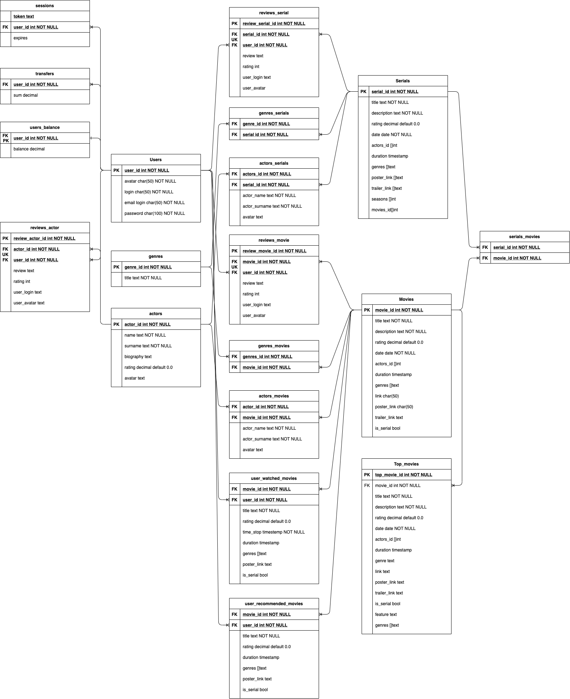

# Курсовая работа по курсу HighLoad
## 1. Тема: Онлайн-кинотеатр
Сервис для просмотра фильмов по подписке.
## 2. Определение возможного диапазона нагрузок подобного проекта
В качестве примера онлайн-кинотеатра я выбрал [ivi.ru](http://ivi.ru). Месячная аудитория сервиса составляет 50 млн. уникальных пользователей, а общая длительность просмотров в 2019 году составила 1 млрд. часов.
## 3. Планируемая нагрузка
Основная нагрузка для сервиса это стриминг видео-файлов. Клиентами могут быть стационарные компьютеры, смартфоны и тв-приставки. Сервисом будет пользоваться примерно 50 млн. человек в месяц, а общая длительность просмотров в месяц составит 100 млн. часов.
## 4. Логическая схема базы данных
Для проекта онлайн-кинотеатра я выделил несколько основных сущностей: "users", "movies", "serials", "actors" и "reviews". Таблица "movies" содержит в себе данные о фильмах и об отдельных эпизодах сериалов. А в таблица "serials" предоставляет информацию о сериалах в целом, а не об отдельных сериях. Изначально схема базы данных была приведена к нормальной форме Бойса-Кодда, но была денормализована из-за и в некоторые таблицы были внесены избыточные данные. Это сделано для уменьшения количества джойнов с крупными таблицами. Так, например, таблицы "reviews_serial", "reviews_movies" и "reviews_actors" дублируют информацию о пользователях из таблицы "users".

## 5. Физическая системы хранения
