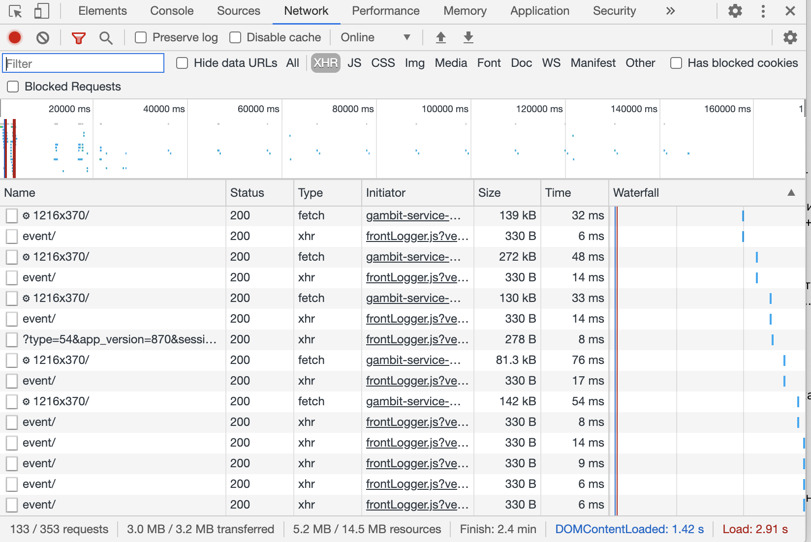
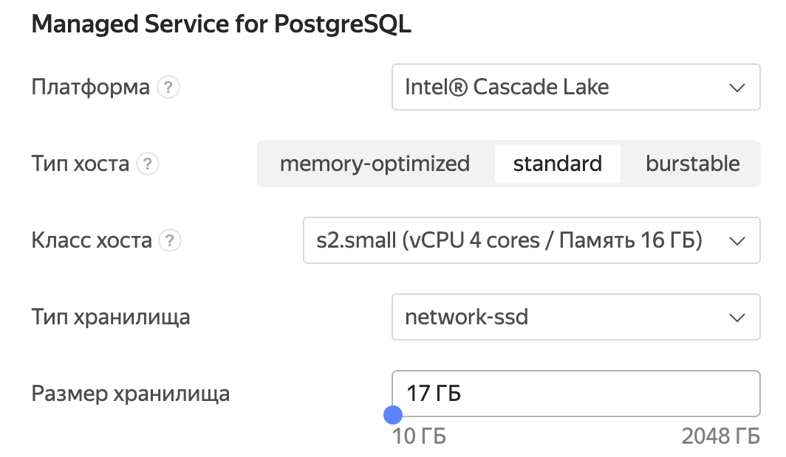
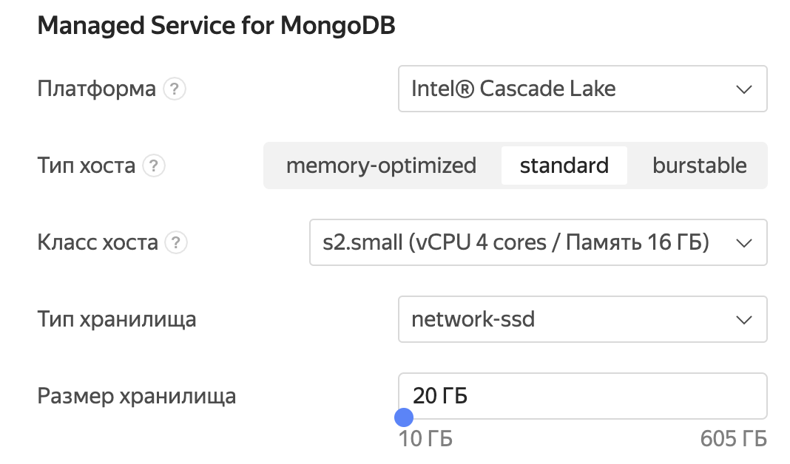

# Курсовая работа по курсу HighLoad
## 1. Тема: Онлайн-кинотеатр
Сервис для просмотра фильмов по подписке.
## 2. Определение возможного диапазона нагрузок подобного проекта
В качестве примера онлайн-кинотеатра я выбрал [ivi.ru](http://ivi.ru). Месячная аудитория сервиса составляет 50 млн. уникальных пользователей, а общая длительность просмотров в 2019 году составила 1 млрд. часов.
## 3. Планируемая нагрузка
Основная нагрузка для сервиса это стриминг видео-файлов. Клиентами могут быть стационарные компьютеры, смартфоны и тв-приставки. Сервисом будет пользоваться примерно 50 млн. человек в месяц, общая длительность просмотров составит 70 млн. часов, а их суммарное количество 250 млн.
## 4. Логическая схема базы данных
Для проекта онлайн-кинотеатра выделим несколько основных сущностей: "users", "movies", "serials", "actors", "reviews" и "recommendations". Таблица "movies" содержит в себе данные о фильмах и об отдельных эпизодах сериалов. А в таблице "serials" предоставляет информацию о сериалах в целом, а не об отдельных сериях. Изначально схема базы данных была приведена к нормальной форме Бойса-Кодда, но была денормализована и в некоторые таблицы были внесены избыточные данные. Это сделано для уменьшения количества джойнов с крупными таблицами. Так, например, таблицы "reviews_serial", "reviews_movies" и "reviews_actors" дублируют информацию о пользователях из таблицы "users". В схеме также содержатся таблицы с рекомендациями для авторизованных пользователей на основе ранее просмотренных фильмов и для неавторизованных пользователей.

## 5. Физическая система хранения
Предположим, что выбор фильма для просмотра занимает у пользователя в среднем 5 хитов. На каждый хит на сайте [ivi.ru](http://ivi.ru) приходится примерно 130 запросов.  Таким образом

Сделаем поправку на то, что ночью трафик падает, а днём и вечером растет. Увеличим среднее RPS в 2.5 раза (~165,000). Основная часть запросов это рекомендации по фильмам (пусть это будет 80%, то есть 132,000).

Таблицы с рекомендациями будут размещаться в базе данных MongoDB на 50 серверах.
То есть в среднем на каждую машину будет приходиться по 2,640 RPS. Главными преимуществами MongoDB для моей задачи является шардинг, быстрый доступ и то, что данные для рекомендаций не ложатся на реляционную модель.  Пусть для каждого пользователя есть 100 рекомендаций фильмов. Размер одной рекомендации составляет 100 байт. Получается, что общий размер сервиса рекомендаций составляет 500 ГБ. На каждом сервере будет храниться 10 ГБ данных.

Информация связанная с пользователями, фильмами и сериалами будут находиться в PostgreSQL на 10 серверах с нагрузкой 2,600 RPS. Я выбрал PostgreSQL, т. к. необходимо надёжное хранение для важных данных, это обеспечивается за счёт реплик для каждого сервера, то есть количество серверов увеличится до 20. На одного пользователя приходится примерно 1 КБ места на диске. Сюда входит личная информация, данные о платежах и учёт просмотренных фильмов. Это число в дальнейшем будет только расти. Таким образом, для всех текущих пользователей необходимо 50 ГБ. Оценим место для хранения информации о фильмах и сериалах. На каждое видео приходится примерно 5 КБ данных. Сюда включено описание фильма, отзывы, список актеров и жанров. В нашем сервисе будет доступно 50,000 видеоматериалов. Суммарно получается 500 МБ данных связанных с фильмами. Для хранения данных на 10 серверах необходим шардинг по идентификатору пользователя, а данные о фильмах будут дублироваться на каждом сервере. Таким образом на одном сервере будет примерно 5,25 ГБ данных.

Оценим размер библиотеки сервиса. Пусть половину видео составляют сериалы, а другую половину фильмы. Общий размер занимаемой памяти одним фильмом примерно 20 ГБ, а сериала 10 ГБ (сюда входят различные разрешения). Тогда размер библиотеки в 50,000 видео - 750 ТБ.

## 6. Выбор прочих технологий: языки программирования, фреймворки, протоколы взаимодействия, веб-сервера и т.д.

**Бэкенд**: Языком разработки выберем Golang. Этот язык доказал, что отлично подходит для систем с высокой нагрузкой: concurrency из коробки, эффективное использование ресурсов, высокая скорость разработки, обширная стандартная библиотека, популярность языка.

**Фронтенд**: Выбираю самый распространенный стек технологий HTML,CSS, JavaScript.

**Мобильные клиенты**: Мобильное приложение для Android будет написано на языках Java и Kotlin. Kotlin является официальным языком разработки для платформы, но Java также необходим, т. к. на Java создано очень много библиотек для Android и далеко не все разработчики ещё освоили Kotlin. Приложение для iOS будет написано на языке Swift.

**Протоколы**: HTTPS - для безопасного соединения клиента и сервера. HTTP внутри датацентра. Protobuf - стандартный протокол для обмена сообщениями между микросервисами в фреймворке gRPC.

**Веб-сервер**: Выбираю nginx из-за быстроты его работы

## 7. Расчет нагрузки и потребного оборудования
1. PostgreSQL

   Возьмём запас по числу пользователей на одном сервере 3х.
   
2. MongoDB

   
3. CDN

   Определим количество серверов для хранения контента. Основным ограничением здесь является пропускная способность.
   Сначала найдём среднее время просмотра фильмов одним пользователями в часах.

   

   Теперь необходимо вычислить количество пользователей, одновременно использующих сервис в течение среднего времени просмотра

   

   Скорость скачивания для качества 1080р составляет 4.5 МБит/с, для 720р - 2.77 МБит/с, для 576р - 1.83 МБит/с, 480р - 1.3 МБит/с, для 360р - 0.79 МБит/с. Тогда средняя скорость - 2.238 МБит/с. Рассчитаем пропускную способность в ГБит/с, которую необходимо обеспечить с учётом поправки на неравномерность трафика.

   

   Один сервер может отдавать примерно 40 ГБит/с. Но пропускная способность это нестабильный ресурс, поэтому нужно четырёхкрантное резервирование. Таким образом, для онлайн-просмотра необходимо 115 серверов.

   Раздавать контент будем с помощью технологии CDN. Для этого распределим контент на 10 origin-серверов для обновления контента. Библиотека будет располагаться на HDD, а свежие данные для обновления удаленных серверов на SSD.
   CPU(cores) | RAM(GB) | HDD(GB)(RAID 10) | SSD(GB)(RAID 10)
   --- | --- | --- | ---
   8 | 16 | 390 * 4096 | 8 * 4096

   На каждом контент-сервере будет храниться 2/3 видеотеки ~ 500 ГБ.
   CPU(cores) | RAM(GB) | HDD(GB)(RAID 0) | SSD(GB)(RAID 0)
   --- | --- | --- | ---
   8 | 16 | 63 * 4096 | 4 * 4096

## 8. Выбор хостинга/облачного провайдера и расположения серверов
Для хостинга серверов баз данных, бэкенда и фронтенда выберем MCS. MCS обладает всеми удобствами и функционалом современного облачного провайдера. Помимо этого сервис имеет множество серверов на территории России.

Контент-сервера будут располагаться в крупных городах России в сетях провайдеров. Но основная часть также будет находиться в Москве в облаке MCS.

## 9. Схема балансировки нагрузки (входящего трафика и внутрипроектного, терминация SSL)
Для балансировки API используем nginx.В nginx реализованы стандартные алгоритмы балансировки, предусмотрена терминация SSL и это самый распространенный веб-сервер - без труда можно найти специалистов.

Для эффективной работы CDN будем использовать Geo-Based DNS для этого разделим территорию России на 6 зон: Дальный Восток, Сибирь, Урал, Юг, Центр и Север. Для каждой зоны укажем IP всех контент-серверов относящихся к ней и по алгоритму round robin будем распределять нагрузку внутри зоны.

## 10. Обеспечение отказоустойчивости
* Отказоустойчивость PostgreSQL будем обеспечивать за счёт реплик исходной базы данных.
* Для бэкенд и фронтенд серверов воспользуемся преимуществами kubernetes - в случае падения одного из бэкендов на его место тут же появится новый. Необходимо ещё настроить тайм-ауты в nginx и rate limit на запросы.
* Видеофайлы хранятся на 10 origin-серверах на массиве RAID 10, который обеспечивает высокую отказоустойчивость и производительность
* Настройка мониторинга сервисов и отслеживание основных показателей нагрузки